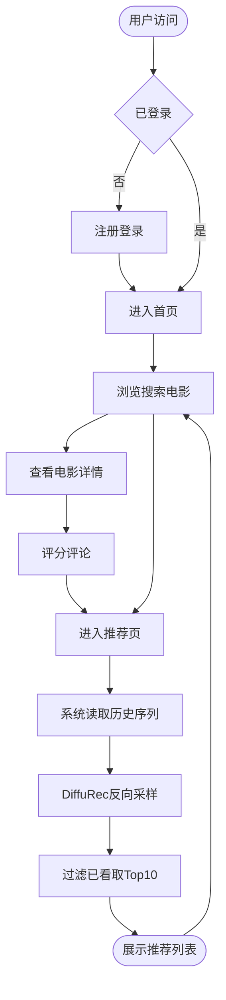

# 论文插图参考

临摹说明：图3.1-3.3 用 draw.io 画框图，图3.4 画流程图。

---

## 图3.1 系统总体架构图

**位置**：3.1 系统总体架构 | **类型**：分层架构框图

```
┌──────────────────────────────────────────────────────┐
│                    表示层（View）                      │
│         Jinja2 模板  ·  HTML/CSS  ·  浏览器           │
└──────────────────────────────────────────────────────┘
                           ↕ HTTP
┌──────────────────────────────────────────────────────┐
│                    业务层（Service）                   │
│   用户模块  │  电影模块  │  推荐模块  │  评论模块  │ 管理模块 │
│                    Flask 路由层                       │
└───────────────────┬──────────────────────────────────┘
                    │              │
         ┌──────────▼──────┐  ┌───▼────────────────────┐
         │    数据层（Data） │  │     模型层（Model）     │
         │                 │  │                        │
         │  SQLite 数据库   │  │  DiffuRec checkpoint   │
         │  ·用户/电影表    │  │  ·模型权重              │
         │  ·评分/评论表    │  │  ·物品嵌入矩阵          │
         │                 │  │  ·用户序列 & ID映射      │
         │  MovieLens-100K │  │                        │
         │  （离线训练数据）  │  │  ← 由 train.py 离线生成  │
         └─────────────────┘  └────────────────────────┘
```

---

## 图3.2 DiffuRec 模型架构图

**位置**：3.3 基于DiffuRec的推荐模型设计 | **类型**：模型组件框图

```
                        AttDiffuseModel
┌────────────────────────────────────────────────────────┐
│                                                        │
│  ┌──────────────────────────────┐                      │
│  │      Embedding 层            │                      │
│  │  item_embeddings: |I|×d      │  d = 128             │
│  │  emb_dropout: 0.3            │  |I| = 1682          │
│  └──────────────┬───────────────┘                      │
│                 │ item_rep [B, L, d]                   │
│  ┌──────────────▼──────────────────────────────────┐  │
│  │                   DiffuRec                       │  │
│  │                                                  │  │
│  │  ┌────────────┐        ┌─────────────────────┐   │  │
│  │  │ 噪声调度器  │        │    DiffuXStart       │   │  │
│  │  │ trunc_lin  │        │                     │   │  │
│  │  │ T = 32 步  │        │ ┌─────────────────┐ │   │  │
│  │  │ LossAware  │        │ │ 时间步嵌入       │ │   │  │
│  │  │ 采样器     │        │ │ sinusoidal, d   │ │   │  │
│  │  └────────────┘        │ └────────┬────────┘ │   │  │
│  │                        │          ↓           │   │  │
│  │  前向加噪(训练)          │ ┌────────▼────────┐ │   │  │
│  │  q_sample(x₀,t)→xₜ    │ │ TransformerRep  │ │   │  │
│  │                        │ │ 4层 × 4头 Attn  │ │   │  │
│  │  反向去噪(推理)          │ │ Pre-LN + GELU  │ │   │  │
│  │  T步迭代 xₜ→x̂₀        │ └────────────────┘ │   │  │
│  │                        └─────────────────────┘   │  │
│  └──────────────────────────────────────────────────┘  │
│                 ↓ x̂₀（去噪后用户兴趣表示）               │
│  ┌──────────────────────────────┐                      │
│  │        输出层                │                      │
│  │  logits = x̂₀ · item_emb^T  │                      │
│  │  训练: CrossEntropy Loss     │                      │
│  │  推理: Top-K 推荐列表        │                      │
│  └──────────────────────────────┘                      │
└────────────────────────────────────────────────────────┘
```

---

## 图3.3 Web 系统功能模块图

**位置**：3.4 Web系统功能设计与实现 | **类型**：模块关系框图

```
┌─────────────────────────────────────────────────────┐
│                    Flask 应用层                      │
│                                                     │
│  ┌──────────┐ ┌──────────┐ ┌──────────┐ ┌────────┐  │
│  │ 用户模块  │ │ 电影模块  │ │ 推荐模块  │ │评论模块│  │
│  │          │ │          │ │          │ │        │  │
│  │ · 注册   │ │ · 列表   │ │ · 序列   │ │ · 评分 │  │
│  │ · 登录   │ │ · 详情   │   构建     │ │ · 评论 │  │
│  │ · 登出   │ │ · 搜索   │ │ · 模型   │ │        │  │
│  │ · 权限   │ │          │   推理     │ └────────┘  │
│  └────┬─────┘ └────┬─────┘ │ · Top-K  │            │
│       │            │       │   过滤    │            │
│       │            │       └────┬─────┘            │
│  ┌────▼────────────▼────────────▼──────────────┐   │
│  │              管理模块 (admin 角色)            │   │
│  │      用户管理  ·  电影管理  ·  评论管理       │   │
│  └──────────────────────────────────────────────┘   │
└────────────────────┬──────────────┬─────────────────┘
                     │              │
          ┌──────────▼────┐  ┌──────▼──────────┐
          │   SQLite DB   │  │ checkpoint.pt   │
          │               │  │                 │
          │ users         │  │ model_state     │
          │ movies        │  │ item_emb        │
          │ ratings       │  │ user_sequences  │
          │ comments      │  │ id_mappings     │
          └───────────────┘  └─────────────────┘
```

---

## 图3.4 核心业务流程图

**位置**：3.6 关键业务流程设计 | **类型**：流程图


