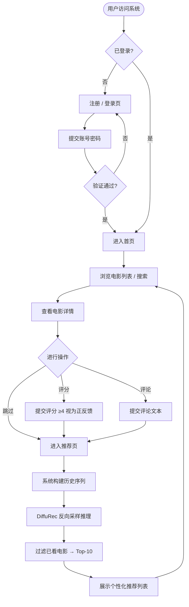
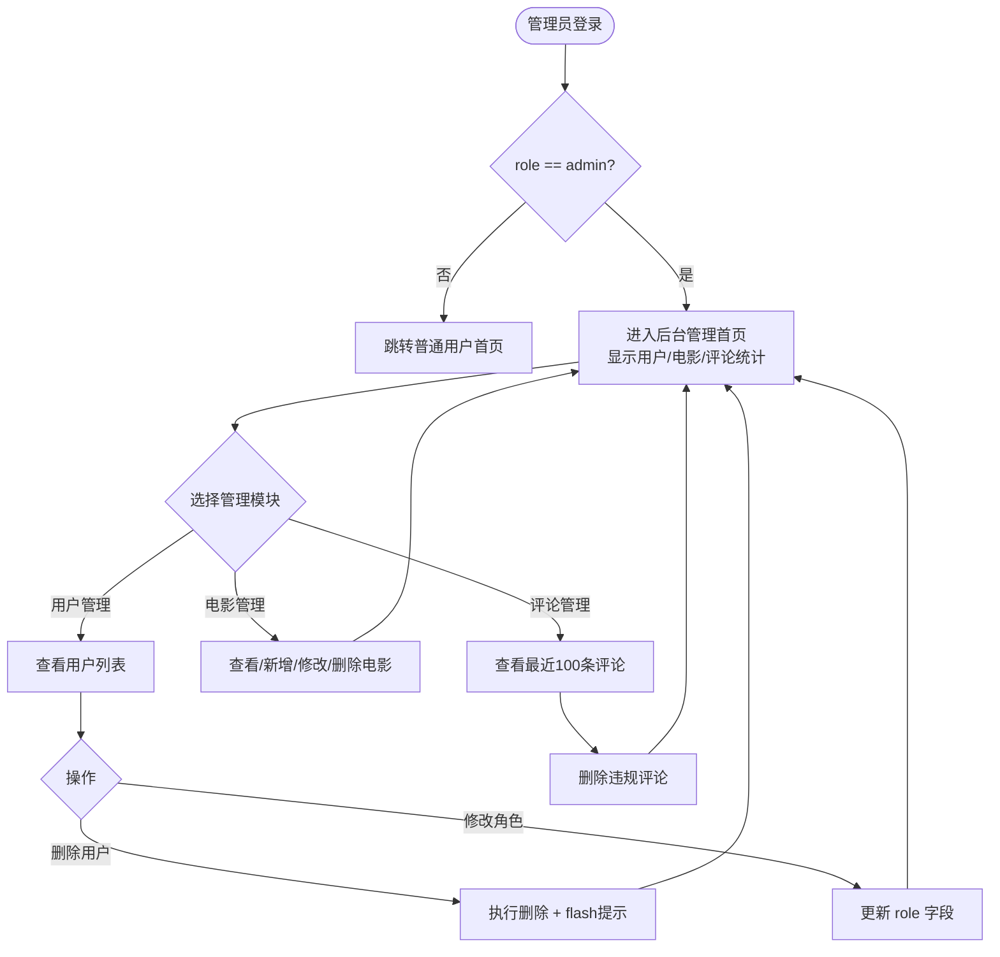

# 论文插图参考 — 架构图 & 模块图

> 每张图下方标注了：图序建议、插入位置、说明要点。  
> 用 Mermaid 语法 + ASCII 辅助，可直接用 Vision / draw.io 临摹。

---

## 图1：系统总体架构（四层 B/S）

**插入位置**：第3章 3.1 系统总体架构  
**图序建议**：图 3.1  
**说明**：展示四层分层 + 离线训练与在线服务的解耦边界

```
┌─────────────────────────────────────────────────────────────────┐
│                        表示层（Presentation）                    │
│   Jinja2 HTML 模板  │  电影列表页  │  推荐页  │  管理后台页       │
└──────────────────────────────┬──────────────────────────────────┘
                               │ HTTP 响应 (渲染变量)
┌──────────────────────────────▼──────────────────────────────────┐
│                        业务层（Business）                         │
│  Flask 路由  │  用户模块  │  推荐引擎  │  评论模块  │  管理模块   │
└──────┬───────────────────────┬──────────────────────────────────┘
       │ SQL 读写               │ 加载 checkpoint / 推理调用
┌──────▼──────────┐    ┌───────▼───────────────────────────────────┐
│   数据层（Data） │    │               模型层（Model）              │
│  SQLite         │    │  checkpoint.pt  │  DiffuRec  │  ID映射表   │
│  · users        │    │  item_emb  ─────► AttDiffuseModel         │
│  · movies       │    │  user_seqs ─────► reverse_p_sample()      │
│  · ratings      │    │                   ↓ logits → Top-K        │
│  · comments     │    └───────────────────────────────────────────┘
│  MovieLens-100K │           ▲
└─────────────────┘           │ 离线训练 (train.py)
                              │
                    ┌─────────┴──────────────┐
                    │   训练管道（Offline）    │
                    │  RecBole → PrefixDS     │
                    │  DiffuRec 前向 + CE 损失│
                    │  早停 → 导出 ckpt       │
                    └────────────────────────┘
```

---

## 图2：DiffuRec 模型内部结构

**插入位置**：第3章 3.3 基于DiffuRec的推荐模型设计  
**图序建议**：图 3.2  
**说明**：展示 AttDiffuseModel → DiffuRec → DiffuXStart → TransformerRep 嵌套关系

```
AttDiffuseModel
├── item_embeddings  (|I| × d)       # 物品嵌入矩阵
├── encode_sequence(seq)             # 输入序列 → item_rep [B, L, d]
│   └── item_embeddings(seq) + emb_dropout
│
├── 训练路径  (train_flag=True)
│   ├── tag_emb = item_embeddings(label)
│   └── diffu_pre(item_rep, tag_emb, mask)
│       └── DiffuRec.forward(item_rep, item_tag, mask)
│           ├── q_sample(x_start=tag_emb, t, noise)   # 前向加噪
│           │     x_t = √ᾱₜ · x₀ + √(1-ᾱₜ) · ε
│           ├── DiffuXStart.forward(item_rep, x_t, t, mask)
│           │   ├── timestep_embedding(t, d)           # 正弦时间步编码
│           │   ├── x_t + t_emb  → 输入拼接
│           │   └── TransformerRep (4层 Multi-Head Attn, Pre-LN)
│           │       └── 输出 x̂₀_pred
│           └── 返回 (x̂₀_pred, weights, t, ...)
│
└── 推理路径  (train_flag=False)
    └── reverse(item_rep, noise_x_t, mask)
        └── DiffuRec.reverse_p_sample(item_rep, noise_x_T, mask)
            └── for t = T..1:
                    p_mean_variance → p_sample → x_{t-1}
            └── 返回 x̂₀  (去噪后用户兴趣向量)

损失计算:
loss = loss_diffu_ce(rep_diffu, labels)
     = CrossEntropy( W · x̂₀,  label_id )
       ─────────────────────────────────
       全量 Softmax，|I|=1682 个候选物品
```

---

## 图3：DiffuRec 扩散过程示意（前向 + 反向）

**插入位置**：第3章 3.3.2 扩散去噪与采样策略  
**图序建议**：图 3.3  
**说明**：简洁展示加噪/去噪方向，配合公式使用

```
训练时（前向加噪）:
                  q(xₜ | x₀)
x₀ (目标物品嵌入) ──────────────────────────────► xₜ (含噪表示)
[item embedding]   t ~ LossAware采样              [高斯噪声混合]
                   噪声调度: trunc_lin
                   √ᾱₜ·x₀ + √(1-ᾱₜ)·ε,  ε~N(0,I)

推理时（反向去噪）:
                  p_θ(x_{t-1} | xₜ, item_rep)
xₜ (随机初始) ◄──────────────────────────────── xₜ
               重复 T=32 步
               每步由 DiffuXStart(θ) 预测 x̂₀
               再由均值公式推算 x_{t-1}

x̂₀ (去噪结果) ──► 与全量物品嵌入矩阵点积 ──► Top-K 推荐列表
```

---

## 图4：训练数据流水线

**插入位置**：第3章 3.2 数据集与数据预处理  
**图序建议**：图 3.4  
**说明**：从原始文件到 DataLoader batch 的完整流程

```
MovieLens-100K (u.data)
        │
        ▼  RecBole create_dataset()
   字段映射 & 过滤
   user_id / item_id / timestamp
        │
        ▼  build_user_sequences()
   按用户聚合 + 时间排序
   {uid: [i₁, i₂, ..., iₙ]}
        │
        ▼  split_user_sequences()
   ┌────┴────────┬──────────────┐
   ▼             ▼              ▼
train_seqs   val_seqs       test_seqs
   │             │              │
   ▼             ▼              ▼
PrefixTrain  NextItemEval   NextItemEval
Dataset      Dataset        Dataset
(前缀随机截取) (最后1项为标签) (val目标追加后)
   │             │              │
   ▼             ▼              ▼
DataLoader   DataLoader     DataLoader
batch_size=512  bs=512         bs=512
shuffle=True    shuffle=False  shuffle=False

batch 输出:
  sequences: [B, L=50]   (左侧 padding=0)
  labels:    [B]          (目标物品 ID)
```

---

## 图5：Web 系统模块关系图

**插入位置**：第3章 3.4 Web系统功能设计与实现  
**图序建议**：图 3.5  
**说明**：Flask 五大模块及其数据依赖关系

```
                        浏览器 (用户)
                             │
                    HTTP Request/Response
                             │
                    ┌────────▼────────┐
                    │  Flask 路由层    │
                    │  app/main.py    │
                    └─┬──┬──┬──┬──┬──┘
                      │  │  │  │  │
          ┌───────────┘  │  │  │  └──────────────┐
          │              │  │  │                  │
    ┌─────▼──────┐  ┌────▼──┐ ┌▼──────────┐ ┌───▼──────────┐
    │  用户模块   │  │电影模块│ │  推荐模块  │ │   评论模块    │
    │ /register  │  │/movies│ │/recommend  │ │ /rate /review│
    │ /login     │  │/search│ │            │ │              │
    │ /logout    │  │/<id>  │ │ ① 序列构建  │ │ 写入评分/评论 │
    └─────┬──────┘  └───┬───┘ │ ② 模型推理  │ └──────┬───────┘
          │             │     │ ③ 结果过滤  │        │
          │             │     └──────┬──────┘        │
          │             │            │                │
          └─────────────┴────────────┴────────────────┘
                                    │
                          ┌─────────┴─────────┐
                          │                   │
                   ┌──────▼──────┐   ┌────────▼────────┐
                   │  SQLite DB  │   │  checkpoint.pt   │
                   │ users       │   │  model_state     │
                   │ movies      │   │  item_emb        │
                   │ ratings     │   │  user_seqs       │
                   │ comments    │   │  id_mappings     │
                   └─────────────┘   └─────────────────┘
                                              │
                                    ┌─────────▼────────┐
                                    │  管理模块          │
                                    │ /admin/users      │
                                    │ /admin/movies     │
                                    │ /admin/reviews    │
                                    │ (需 admin 角色)    │
                                    └──────────────────┘
```

---

## 图6：在线推荐推理流程（序列图）

**插入位置**：第3章 3.4.2 推荐与评论模块  
**图序建议**：图 3.6  
**说明**：用户请求 /recommend 到返回列表的完整时序

```
用户浏览器       Flask路由        SQLite          checkpoint       AttDiffuseModel
    │               │               │                │                   │
    │  GET /recommend│               │                │                   │
    │───────────────►│               │                │                   │
    │               │── 查用户历史评分►│               │                   │
    │               │◄── ratings[] ──│               │                   │
    │               │                │                │                   │
    │               │── 加载checkpoint (启动时已缓存) ──►│                   │
    │               │                │  user_seqs[uid]│                   │
    │               │                │  id_mappings   │                   │
    │               │                │                │                   │
    │               │  构建序列: base_seq + 新增正反馈   │                   │
    │               │  padding 至长度 50               │                   │
    │               │                │                │  forward(seq, label, │
    │               │────────────────────────────────────────────────────►│
    │               │                │                │  train_flag=False) │
    │               │                │                │  reverse_p_sample  │
    │               │◄──────────────────────────────────── rep_diffu ──────│
    │               │                │                │                   │
    │               │  diffu_rep_pre: rep_diffu · item_emb^T → scores     │
    │               │  过滤已交互物品 + padding(ID=0)                       │
    │               │  Top-10 → 转回原始电影ID                              │
    │               │── 查电影详情 ───►│               │                   │
    │               │◄── movie info ──│               │                   │
    │  推荐列表页面   │               │                │                   │
    │◄───────────────│               │                │                   │
```

---

## 图7：普通用户业务流程图

**插入位置**：第3章 3.6.1 普通用户流程  
**图序建议**：图 3.7



---

## 图8：管理员后台流程图

**插入位置**：第3章 3.6.2 管理员流程  
**图序建议**：图 3.8



---

## 图9：系统部署架构（轻量单机）

**插入位置**：第3章 3.7.2 部署与异常兜底  或 第4章讨论部分  
**图序建议**：图 3.9

```
┌────────────────────────────────────────────────┐
│               单台服务器 / 本地开发机             │
│                                                │
│  ┌──────────────────────────────────────────┐  │
│  │          Python 进程 (Flask)              │  │
│  │  app/main.py                             │  │
│  │  ├── 启动时加载 saved/model_checkpoint.pt │  │
│  │  ├── SQLite  movie_app.db               │  │
│  │  └── 监听 0.0.0.0:5000                  │  │
│  └──────────────────────────────────────────┘  │
│                                                │
│  ┌──────────────────────────────────────────┐  │
│  │          离线训练（按需执行）               │  │
│  │  python train.py                         │  │
│  │  ├── RecBole 加载 dataset/ml-100k        │  │
│  │  ├── GPU 训练 DiffuRec (500 epochs)      │  │
│  │  └── 导出 saved/model_checkpoint.pt      │  │
│  └──────────────────────────────────────────┘  │
│                                                │
│  文件系统:                                      │
│  dataset/ml-100k/   RecBole 数据集              │
│  saved/             模型权重 & ID映射            │
│  app/movie_app.db   SQLite 业务数据库            │
└────────────────────────────────────────────────┘
          ▲
          │ HTTP :5000
          │
     用户浏览器
```

---

## 汇总：各图对应论文章节

| 图序  | 图名                   | 插入章节               |
|-------|------------------------|------------------------|
| 图3.1 | 系统总体架构（四层）     | 3.1 系统总体架构        |
| 图3.2 | DiffuRec 模型结构       | 3.3.1 模型输入与条件建模 |
| 图3.3 | 扩散前向/反向过程示意    | 3.3.2 扩散去噪与采样    |
| 图3.4 | 训练数据流水线           | 3.2 数据集与预处理      |
| 图3.5 | Web 系统模块关系         | 3.4 Web功能设计与实现   |
| 图3.6 | 在线推荐推理时序         | 3.4.2 推荐与评论模块    |
| 图3.7 | 普通用户业务流程         | 3.6.1 普通用户流程      |
| 图3.8 | 管理员后台流程           | 3.6.2 管理员流程        |
| 图3.9 | 系统部署架构             | 3.7.2 部署与异常兜底    |
